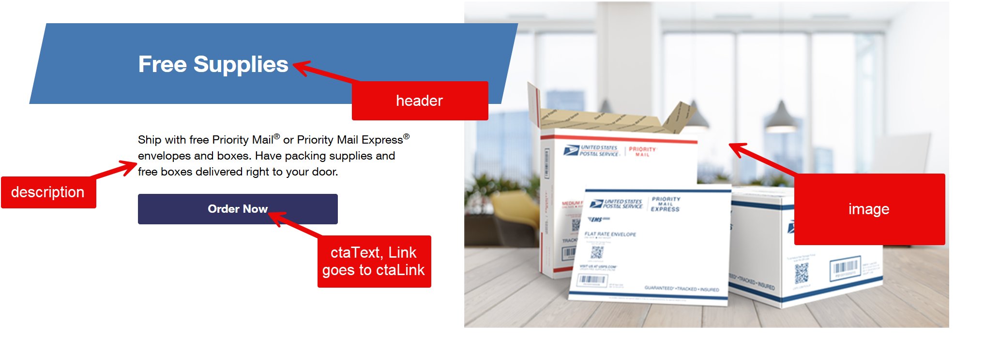

# Teaser Block - Product Requirements Document

## Overview
The Teaser Block is a flexible, engaging preview component designed to promote postal services, news, and marketing content. It serves as a key conversion tool throughout the website, providing compelling previews that encourage user engagement and drive action.

## Component Purpose
Create visually appealing content previews that can be used across various sections of the postal website to:
- Highlight featured services and promotions
- Preview blog posts and news articles
- Drive traffic to key landing pages
- Encourage newsletter signups and service inquiries
- Cross-sell related postal services

## Visual Reference


The annotated screenshot above shows the teaser block structure with:
- **Header**: The main title "Free Supplies" positioned prominently at the top
- **Description**: Supporting text explaining the service offering and benefits
- **Image**: Visual content on the right side showing postal supplies and boxes
- **CTA Text & Link**: "Order Now" button that links to the specified destination

## Authorable Fields

### Field Structure
The teaser block contains 5 authorable fields that content creators can customize:

| Field Name | Type | Required | Description | Sample Value |
|------------|------|----------|-------------|--------------|
| **header** | Text | Yes | Main headline for the teaser | "Teaser Header" |
| **description** | Rich Text | Yes | Supporting description text | "Teaser Description" |
| **image** | Media | Yes | Hero image for visual impact | [Rocket dial image showing performance metrics] |
| **ctaLink** | Link | Yes | Destination URL for the call-to-action | "https://www.google.com" |
| **ctaText** | Text | Yes | Call-to-action button text | "Go here to google" |

### Field Requirements

#### Header Field
- **Purpose**: Primary attention-grabbing headline
- **Character Limit**: 60 characters recommended for optimal display
- **Format**: Plain text with automatic line wrapping
- **SEO**: Will be wrapped in appropriate heading tags (H2 or H3)

#### Description Field
- **Purpose**: Supporting content that provides context and details
- **Character Limit**: 150-200 characters recommended
- **Format**: Rich text supporting basic formatting (bold, italic)
- **Line Height**: Optimized for readability at 1.5x

#### Image Field
- **Purpose**: Visual element that captures attention and supports messaging
- **Format**: JPG, PNG, WebP supported
- **Responsive**: Multiple breakpoints with optimized sizing
- **Alt Text**: Automatically generated from filename, manually editable
- **Aspect Ratio**: 16:9 recommended, flexible for various layouts

#### CTA Link Field
- **Purpose**: Destination for user action
- **Format**: Full URLs (external) or relative paths (internal)
- **Validation**: URL format validation with protocol requirement
- **Tracking**: Analytics tracking parameters automatically appended

#### CTA Text Field
- **Purpose**: Action-oriented button text
- **Character Limit**: 25 characters recommended
- **Format**: Plain text, automatically converted to title case
- **Accessibility**: Descriptive text for screen readers

## Layout Configurations

### Primary Layout (Default)
```
[Image - 50% width] [Content - 50% width]
                    [Header]
                    [Description]
                    [CTA Button]
```

### Responsive Behavior
- **Desktop (1024px+)**: Side-by-side image and content
- **Tablet (768px-1023px)**: Maintained side-by-side with adjusted proportions
- **Mobile (320px-767px)**: Stacked layout with image on top

## Visual Design Requirements

### Typography
- **Header**: Primary heading font, bold weight, larger size
- **Description**: Body font, regular weight, optimized line height
- **CTA Button**: Button font, medium weight, proper contrast

### Color Scheme
- **Background**: Neutral background with subtle elevation
- **Text**: High contrast for accessibility compliance
- **CTA Button**: Primary brand color with hover states
- **Border**: Subtle border or shadow for definition

### Interactive States
- **Default**: Clean, professional appearance
- **Hover**: Subtle elevation and button color change
- **Focus**: Keyboard navigation outline for accessibility
- **Loading**: Progressive image loading with placeholder

## Accessibility Requirements

### WCAG 2.1 AA Compliance
- **Color Contrast**: Minimum 4.5:1 ratio for text
- **Keyboard Navigation**: Full keyboard accessibility
- **Screen Readers**: Proper ARIA labels and semantic markup
- **Focus Management**: Clear focus indicators
- **Alt Text**: Descriptive image alternative text

### Semantic HTML
- Use proper heading hierarchy
- Semantic button elements for CTAs
- Descriptive link text for accessibility
- Proper landmark roles

## Performance Requirements

### Loading Optimization
- **Lazy Loading**: Images load as they enter viewport
- **Progressive Enhancement**: Content-first loading approach
- **Responsive Images**: Appropriate image sizes per device
- **Compression**: Optimized image delivery

### Bundle Size
- **CSS**: Minimal, component-scoped styles
- **JavaScript**: Lightweight interaction handling
- **Total Impact**: <10KB additional bundle size

## Content Guidelines

### Header Best Practices
- Use active voice and action-oriented language
- Keep under 60 characters for optimal display
- Include primary keyword for SEO
- Avoid technical jargon

### Description Best Practices
- Provide clear value proposition
- Use benefit-focused language
- Keep scannable with short sentences
- Include secondary keywords naturally

### CTA Best Practices
- Use action verbs (Get, Start, Learn, Discover)
- Create urgency when appropriate
- Match user intent and expectations
- Test different variations for conversion

## Use Cases

### Homepage Implementation
- **Service Highlights**: Feature top 3 postal services
- **News Previews**: Latest company updates and announcements
- **Promotional Content**: Current offers and seasonal campaigns

### Service Pages
- **Related Services**: Cross-sell complementary offerings
- **Success Stories**: Customer testimonials and case studies
- **Resource Links**: Helpful guides and documentation

### Blog/News Section
- **Article Previews**: Featured and recent blog posts
- **Category Navigation**: Topic-based content discovery
- **External Resources**: Partner content and industry news

## Technical Implementation

### File Structure
```
blocks/teaser/
├── teaser.css    # Component styling
├── teaser.js     # Interactive behavior
└── README.md     # Implementation guide
```

### CSS Architecture
- BEM methodology for class naming
- CSS custom properties for theming
- Mobile-first responsive approach
- Component-scoped styles

### JavaScript Functionality
- Progressive enhancement
- Event delegation for performance
- Accessible interaction patterns
- Analytics tracking integration

## Success Metrics

### Performance Indicators
- **Click-through Rate**: Measure CTA engagement
- **Time on Page**: Assess content effectiveness
- **Conversion Rate**: Track goal completions
- **Bounce Rate**: Monitor content relevance

### A/B Testing Opportunities
- Different CTA button text variations
- Image vs. text-heavy layouts
- Color scheme variations
- Placement and sizing options

## Future Enhancements

### Phase 2 Features
- **Video Support**: Background video or embedded players
- **Animation Options**: Subtle entrance animations
- **Advanced Layouts**: Multiple layout variations
- **Dynamic Content**: API-driven content population

### Integration Possibilities
- **Personalization**: User-specific content recommendations
- **Analytics**: Advanced tracking and heat mapping
- **CMS Integration**: Direct connection to content management
- **Marketing Automation**: Campaign-specific variations
