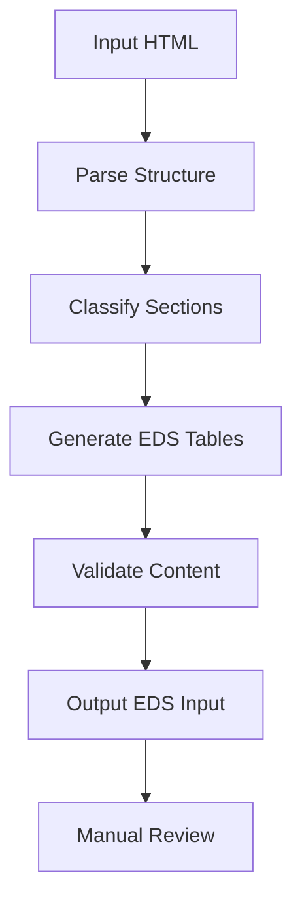

# EDS Content Reverse Engineering Guide

This document outlines the process and methodology for reverse engineering rendered HTML output back into EDS (Adobe Edge Delivery Services) input format for content migration and prototyping.

## Overview

When migrating content from external sources or prototyping new layouts, we often start with a rendered HTML output and need to convert it back into the EDS authoring format that uses tables with `colspan="2"` to define blocks.

## Process Demonstrated

### Files Created in This Exercise

- `demo2-input.html` - Example EDS input format showing the table structure
- `demo2-output.html` - Corresponding rendered output showing how blocks are transformed
- `newpage1-out.html` - Complex postal website output to be reverse engineered
- `newpage1-input.html` - Reverse engineered EDS input format

### Key Principles Discovered

1. **Block Definition Pattern**: Each block starts with a table row containing `<td colspan="2">` with the block name
2. **Key-Value Structure**: In configuration rows, left column = key (data mapping), right column = value (customer content)
3. **Content Preservation**: Every word from the original output must be preserved in the input
4. **Mixed Content Strategy**: Some sections become blocks (tables), others remain as regular HTML between blocks

## Reverse Engineering Methodology

### Step 1: Content Analysis
```markdown
1. Read the complete output HTML file
2. Identify distinct sections and their purposes:
   - Hero sections with CTAs
   - Form components
   - Card-based layouts
   - Statistics/metrics
   - Footer navigation
```

### Step 2: Block Classification
```markdown
Classify each section as either:
- **Structured Block**: Needs table format with key-value pairs
- **Content Block**: Grid/card layout using table rows
- **Regular HTML**: Simple content between blocks (headings, paragraphs)
```

### Step 3: EDS Input Conversion

#### For Structured Blocks (Key-Value Pairs):
```html
<table>
    <tbody>
        <tr>
            <td colspan="2">
                <p>block-name</p>
            </td>
        </tr>
        <tr>
            <td>
                <p>key-field</p>
            </td>
            <td>
                <p>Customer-facing content</p>
            </td>
        </tr>
    </tbody>
</table>
```

#### For Content Blocks (Cards/Grid):
```html
<table>
    <tbody>
        <tr>
            <td colspan="2">
                <p>cards</p>
            </td>
        </tr>
        <tr>
            <td>
                <h3>Card 1 Content</h3>
                <p>Description...</p>
            </td>
            <td>
                <h3>Card 2 Content</h3>
                <p>Description...</p>
            </td>
        </tr>
    </tbody>
</table>
```

## Block Types Identified

### Existing EDS Blocks
- `cards` - Grid layouts with multiple content items
- `footer` - Site footer with navigation
- `hero` - Main banner sections
- `form` - Interactive forms

### New Blocks Proposed
- `stats` - Statistics/metrics display
- `cta` - Call-to-action sections
- Custom blocks as needed for specific layouts

## Automation Opportunities

### Phase 1: Semi-Automated Analysis
```javascript
// Pseudocode for content analyzer
function analyzeHTMLStructure(htmlContent) {
    // 1. Parse DOM structure
    // 2. Identify semantic sections
    // 3. Extract text content and hierarchy
    // 4. Suggest block classifications
    // 5. Generate EDS table structure
}
```

### Phase 2: AI-Assisted Conversion
```markdown
Leverage AI to:
1. **Content Extraction**: Parse HTML and extract meaningful content
2. **Pattern Recognition**: Identify common UI patterns (hero, cards, forms)
3. **Block Mapping**: Suggest appropriate EDS block types
4. **Key-Value Generation**: Create field mappings for structured content
```

### Phase 3: Template-Based Generation
```markdown
Create reusable templates for common patterns:
- Hero sections with badges and CTAs
- Pricing/service cards
- Statistics grids
- Contact forms
- Footer navigation
```

## Implementation Strategy

### Tools to Develop

1. **HTML Parser**: Extract content and structure
2. **Block Classifier**: AI/rule-based block type detection
3. **EDS Generator**: Convert to table format
4. **Validation Tool**: Ensure content preservation

### Workflow Automation



## Best Practices

### Content Preservation
- ✅ Every text element must be preserved
- ✅ Maintain semantic hierarchy (h1, h2, h3, etc.)
- ✅ Preserve links and formatting
- ❌ Never lose customer-facing content

### Block Structure
- ✅ Use `colspan="2"` for block definitions
- ✅ Left column = key, right column = value
- ✅ Group related content logically
- ❌ Don't create overly complex nested structures

### Performance Considerations
- ✅ Regular HTML for simple content
- ✅ Blocks for interactive/styled components
- ✅ Minimize table nesting
- ❌ Don't over-engineer simple text sections

## Future Enhancements

### Short Term
1. Create block detection regex patterns
2. Build content extraction utilities
3. Develop EDS table generators

### Medium Term
1. AI model training for pattern recognition
2. Visual block boundary detection
3. Automated field naming conventions

### Long Term
1. Real-time HTML to EDS conversion
2. Visual editor integration
3. Content migration pipeline

## Usage Instructions

### For Manual Conversion
1. Analyze the output HTML structure
2. Identify logical content sections
3. Classify each section by type
4. Create EDS table structure
5. Map content to key-value pairs
6. Validate content preservation

### For Tool Development
1. Use this guide as specification
2. Implement parsers for common patterns
3. Create templates for reusable blocks
4. Build validation against content loss
5. Integrate with EDS development workflow

## Conclusion

This reverse engineering process transforms complex HTML outputs into EDS-compatible input formats while preserving all content and maintaining the flexibility of the EDS block system. The methodology can be systematized and automated to streamline content migration and prototyping workflows.

The key insight is that EDS input format serves as both an authoring interface and a data structure that can be programmatically generated from various sources, making it an ideal target for content migration tools.